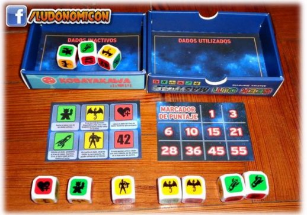

 \
Programación Orientada a Eventos 2023-1 \
Profesor: Carlos Felipe Montoya Rincon \
carlos.felipe.montoya@correounivalle.edu.co 

---

# Mini proyecto 1: Geek Out Master

## Introducción

El objetivo de este juego es conseguir la mayor cantidad de puntos juntando dados cuya cara visible es la cara 42. Geek Out Masters no es solo suerte, también importa la estrategia ya que una vez que se lanzan los dados TODAS las caras deberán ejecutarse, las caras están dadas así:

- Los Meeples permiten relanzar los dados.
- Las Naves Espaciales eliminan un dado
- Los Superhéroes revelarán el lado oculto de la cara.
- Los Corazones nos brindarán un dado extra
- Los Dragones causan pérdida.

El juego está compuesto por: ¡10 dados de Geek Out!, 1 ayuda memoria, 1 Tarjeta de puntuación.

El área de juego está compuesta de 4 sectores (ver Figura 1):

1. Los dados activos.
1. Los dados Inactivos.
1. Los dados utilizados.
1. La tarjeta de puntuación

Figura 1. Zona de juego geek out master

Igualmente, se cuenta con una ayuda explicativa de las acciones, es decir, como se debe interpretar cada cara del dado (ver figura 2)

Cada una de las 6 caras de los dados tienen 1 dibujo que permite al jugador realizar 1 acción especial:

1. El Meeple permite relanzar otro dado en juego, es decir, de la sección dados activos.
1. La Nave Espacial envía un dado no usado (de la sección dados activos) a la sección de dados inactivos.
1. El Superhéroe permite que cualquier dado no usado (sección dados activos) sea volteado y colocado en su cara opuesta.
1. El corazón permite tomar un dado de la sección de dados inactivos y lanzarlo para que sea un nuevo dado activo.
1. El Dragón es la cara que se quiere evitar, ya que si al final de la ronda es el último dado activo que queda se habrán perdido todos los puntos ganados y acumulados.
1. 42 es la cara que permite sumar puntos al final de la ronda.

Las caras contrarias del dado corresponden a sus colores, es decir, la cara contraría al Corazón es el 42, ya que tienen el mismo color (rojo); la cara contraria del Meeple es el Cohete o Nave Espacial y la cara contraria del Superhéroe es el Dragón.

Figura 2. Tarjeta de acciones de geek out master

## Dinámica del juego:

De los 10 dados que trae el juego se toman 3 y se colocan en el sector de "Dados Inactivos". Los otros 7 dados se tiran y pasan a ser los "Dados Activos".

Se van eligiendo los dados a utilizar según las habilidades de sus caras y se pasan al sector de "Dados Utilizados".

Si como último dado activo queda un Dragón, se perderán todos los puntos acumulados.

Este juego lo jugará un único jugador y ganará si logra sumar 30 puntos o más en 5 rondas consecutivas de juego.

## Puntaje:

Al finalizar cada turno o ronda se cuenta la cantidad de dados con cara 42 en el área de dados puntuados teniendo en cuenta las reglas de la figura 3. Se debe tener presente que, en cualquier ronda, existe el riesgo de quedar con un dragón en la zona de dados activos, en cuyo caso, los puntos de la ronda como los puntos acumulados (si se han jugado varias rondas) son eliminados, quedando con cero puntos.

Figura 3. Reglas para asignación de puntos por cada dado con cara 42 en la zona de dados activos Como ayuda para entender la dinámica del juego ver el siguiente [video](https://www.youtube.com/watch?v=GBfCjsriZBg).

## Ejemplo de una ronda de juego:

El jugador tira sus dados y obtiene 2 Naves espaciales, 2 Dragones, 1 Superhéroe, 1 Corazón y 1 Meeple.

Figura 4. Ejemplo de inicio de una roda de juego

Sus opciones siempre tienen que tratar de tender a no conservar ninguno de los dragones porque es lo terminaría su turno de forma negativa, así que decide antes que nada usar su Superhéroe para girar 1 Dragón, que le otorga nuevamente 1 Superhéroe. Luego usa un Cohete para eliminar al Dragón restante. Quedando con 2 Corazones, 1 Superhéroe y 1 Cohete en la zona de dados activos y con tres dados en la zona de datos utilizados ya que siempre que se use un dado este deberá ser descartado a la zona de dados utilizados. En la figura 4 se muestra el estado del juego ante las acciones antes indicadas.

Figura 5. Ejemplo estado del juego luego de ejecutar acciones

Ahora tiene en juego 2 Corazones, 1 Superhéroe y 1 Nave espacial. Para completar la ronda rápido y sin más riesgos usa su Nave espacial para desterrar uno de sus Corazones a la sección de dados inactivos y con el dado de Superhéroe invierte el dado con Corazón a su cara opuesta: el 42. Siendo esta su última acción posible coloca el dado en la primera posición del marcador de puntaje. El jugador ha ganado 1 punto en la ronda de juego, como se muestra en la Figura 5.

Figura 6. Ejemplo finalización de una ronda de juego.

## Observaciones:

Antes de comenzar el turno, se deben colocar 3 dados en el área de dados inactivos y 7 en la de dados activos.

El turno comienza con el jugador lanzando los 7 dados activos y finaliza cuando se hayan realizado las acciones de todos los dados activos (la acción del dado depende de la cara que haya salido). Es **obligatorio** realizar las acciones de los dados, siempre que se pueda. Por lo tanto, el orden al realizar las acciones es fundamental y debe decidirse estratégicamente, pero esto lo decide el jugador. A medida que se ejecutan las acciones, los dados con los cuales se realizan dichas acciones deben pasarse al área de dados utilizados. Una vez que ya no queden acciones disponibles, debe chequearse qué dados permanecen en el área de dados activos. De acuerdo a esto se tiene:

- Si sólo hay dados con la cara 42 en área de dados activos, estos se registran en el área de dados puntuados, para saber los puntos logrados en el turno o ronda.
- Si entre los dados activos solo hay dragones el jugador no obtiene ningún punto en la ronda y pierde incluso los puntos acumulados.
- Si el último dado de la zona de dados activos es un Meeple, un Superhéroe o un Cohete, la ronda de juego termina sin ganar puntos y se conservan los puntos que se tengan acumulados.
- Si no queda ningún dado en el área de dados activos, se finaliza la ronda de juego sin ganar puntos, pero se conservan los puntos que se lleven acumulados.

El juego en individual implica un máximo de 5 rondas al final de las cuales si el jugador logró sumar 30 puntos gana, en caso contrario pierde y puede iniciar un nuevo juego.

## Historias de Usuario

|**Historia Iniciar\_Ronda**|**Criterios de Aceptación**|
| - | - |
|
**Como** jugador

**deseo** iniciar la ronda de juego

**para** ver las caras de los 7 dados activos
|
- El área de juego está compuesta de 4 sectores:

&emsp;- Dados activos: inicia con 7 dados cuyas caras visibles se seleccionan aleatoriamente.

&emsp;- Dados Inactivos: inicia con 3 dados, no tienen importancia cual es la cara visible.

&emsp;- Dados utilizados: inicia vacía

&emsp;- Marcador de Puntaje: solo muestra los números 1, 3, 6, 10, 15, 21, 28, 36, 45 y 55 (potenciales puntos a ganar en la ronda)

- El usuario debe poder acceder a la ayuda explicativa de las acciones, si lo requiere.

- El usuario debe poder ver en qué ronda del juego se encuentra.

- El usuario debe poder ver los puntos que lleva acumulados si previamente ha jugado una ronda.

- El jugador debe poder en cualquier momento salir del juego si lo desea.
|

|**Historia Ejecutar\_Acciones**|**Criterios de Aceptación**|
| :- | - |
|
**Como** jugador

**deseo** seleccionar dados de la zona de dados activos

**para** utilizarlos y saber si logro sumar puntos en la ronda de juego y ganar el juego.
|
- Los dados de la zona de dados activos se seleccionan de uno por vez.

- Un dado seleccionado de la zona de dados activos debe pasar a la zona de dados utilizados y solo debe permitir ejecutar la acción relacionada con la cara visible del dado seleccionado.

- Las posibles acciones a realizar según la cara visible del dado son:

&emsp;- **Meeple**: permite al jugador poder volver a lanzar uno de los dados activos.

&emsp;- **Cohete**: permite al jugador eliminar un dado pasándolo al área de dados inactivos.

&emsp;- **Superhéroe**: permite al jugador dar vuelta (mostrar la cara opuesta) de un dado de la zona de dados activos. Un Superhéroe no puede voltearse a sí mismo.

&emsp;- **Corazón**: permite al jugador tomar un dado de la zona de dados inactivos y lanzarlo en la zona de dados activos.

&emsp;- **Dragón**: Si es el último de los dados activos, hace que el jugador pierda todos los puntos que lleve hasta el momento.

&emsp;- **42**: Si el último o últimos dados activos tiene esta cara visible, se suman dichos puntos en el tablero de puntaje, acorde con las reglas indicadas, generando el puntaje de la ronda.

Las caras contrarias del dado se corresponden con el color que comparten:

&emsp;- Meeple y Cohete son contrarios

&emsp;- Dragón y Superhéroes son contrarios

&emsp;- Corazón y 42 son contrarios 

 - Una vez el usuario termine de ejecutar las acciones que le permiten sus dados activos, debe calcularse los puntos logrados en la ronda de juego y se debe permitir al jugador iniciar una nueva ronda de juego o indicar el estado del juego (ganar o perder). 

 - Los puntos logrados en la ronda de juego se determinan chequeando qué dados permanecen en el área de dados activos, cuándo ya no se puede ejecutar más acciones. Teniendo en cuenta que:

&emsp;- Si sólo hay dados con la cara 42, estos se registran en el área de dados puntuados, para saber los puntos logrados en la ronda.

&emsp;- Si solo hay dragones el jugador no obtiene ningún punto y pierde incluso sus puntos acumulados.

&emsp;- Si no queda ningún dado en la zona de dados activos, o si el último dado de la zona de dados activos es un Meeple, un Superhéroe o un Cohete, la ronda de juego termina sin ganar puntos y se conservan los puntos que se tengan acumulados.

 - El jugador podrá iniciar una ronda de juego si no ha completado el máximo de 5 rondas y tiene menos de 30 puntos. 

 - El jugador ganará si alcanza los 30 puntos o más en máximo 5 rondas de juego.

 - El Jugador perderá si terminada la 5ta ronda de juego tiene menos de 30 puntos acumulados

 - Si el jugador gana o pierde podrá reiniciar el juego.

 - El usuario debe poder acceder a la ayuda explicativa de las acciones, si lo requiere.

 - El usuario debe poder ver en qué ronda del juego se encuentra.

 - El usuario debe poder ver los puntos que lleva acumulados si previamente ha jugado una ronda.
|

## Definition of Done (DoD):

- Se considera cumplida las historias de usuario si:

[ ] Se cumplen los criterios de aceptación\
[ ] Se entrega análisis de clases (en el proyecto debe existir un paquete llamado “disenoClases”, en esta carpeta incluirá un archivo .pdf con el análisis de clases.

- El código fuente entregado cumple con:

[ ] Implementar el patrón MVC\
[ ] Estar documentado (descripción clara y detallada de clases y métodos)\
[ ] Se cumple con las normas de estilo definidas para el curso.\
[ ] Se entrega enlace al repositorio GitHub (es obligatorio)\
[ ] Los Commits evidencian la evolución del desarrollo y los aportes de cada miembro del equipo al desarrollo del producto.\
[ ] Se han aplicado buenas prácticas en el diseño de la interfaz gráfica de usuario (GUI)\

